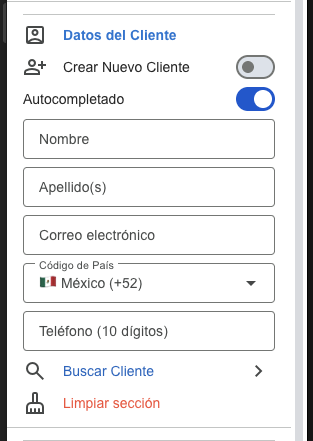
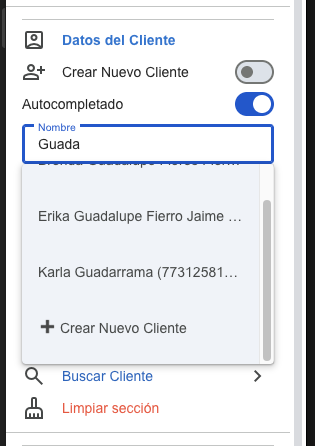
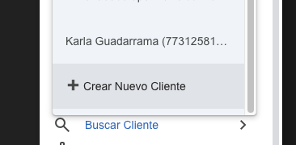
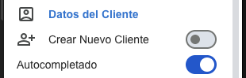
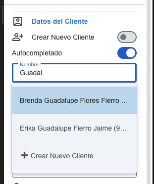
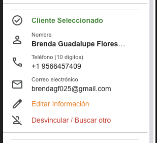
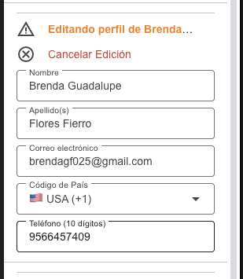

# Guía Rápida: Selección y Registro de Clientes
## CC Appointment Manager

Esta guía detalla el nuevo flujo de trabajo para la selección y registro de clientes. Hemos rediseñado este proceso para asegurar la integridad de los datos y evitar la sobreescritura accidental de perfiles mediante una **Resolución de Identidad Segura**.

---

### 1. Nueva Estructura del Formulario
Al abrir el formulario de cita, notarás dos controles clave en la parte superior de la sección **Datos del Cliente**:

*   **Crear Nuevo Cliente (Switch):** Por defecto está **APAGADO**. Solo debe encenderse si después de buscar, estás seguro de que el cliente no existe y deseas crearlo desde cero.
*   **Autocompletado (Switch):** Por defecto está **ENCENDIDO**. Activa la búsqueda inteligente en cache local para agilizar el registro.

---

### 2. Búsqueda Inteligente y Autocompletado
Al comenzar a escribir el nombre del cliente, el sistema mostrará sugerencias basadas en la base de datos.

> [!TIP]
> Si la búsqueda local no arroja resultados, puedes usar la opción **"Buscar Cliente"** al final de la sección para realizar una consulta directa y exhaustiva a la base de datos central.

---

### 3. Registro Rápido desde Sugerencias
Si identificas que el cliente es nuevo directamente desde la lista de sugerencias, hemos agregado un acceso directo.

Al seleccionar **"+ Crear Nuevo Cliente"** en la lista desplegable, el switch principal se activará automáticamente y limpiará los campos para un registro limpio.

---

### 4. Control de Autocompletado
Puedes apagar el autocompletado si prefieres capturar los datos manualmente sin sugerencias, aunque se recomienda mantenerlo activo para evitar duplicados.

---

### 5. Selección y Bloqueo de Seguridad
Al seleccionar un cliente de las sugerencias, los datos se cargarán y el perfil se **BLOQUEARÁ** para edición inmediata. Esto es una medida de seguridad para evitar que cambios accidentales sobreescriban el perfil original.

---

### 6. Vista Protegida del Cliente
Una vez que un cliente ha sido vinculado exitosamente, la sección cambia a un modo de **"Solo Lectura"**. Aquí verás los datos principales y dos acciones claras:

*   **Editar Información:** Abre los campos para modificaciones intencionales.
*   **Desvincular / Buscar otro:** Limpia la selección para que puedas buscar a un cliente diferente.

---

### 7. Modo de Edición Intencional
Solo si el usuario presiona **"Editar Información"**, el sistema habilitará los campos. Verás una advertencia de **"Editando perfil de..."** para que seas consciente de que cualquier cambio afectará la base de datos permanente del cliente.

Puedes cancelar la edición en cualquier momento para volver al modo de solo lectura sin aplicar cambios.

---
> [!IMPORTANT]
> Esta refactorización protege nuestra base de datos contra "colisiones de datos" y sobreescrituras accidentales. Siempre verifica si el cliente ya existe antes de activar el switch de "Nuevo Cliente".
